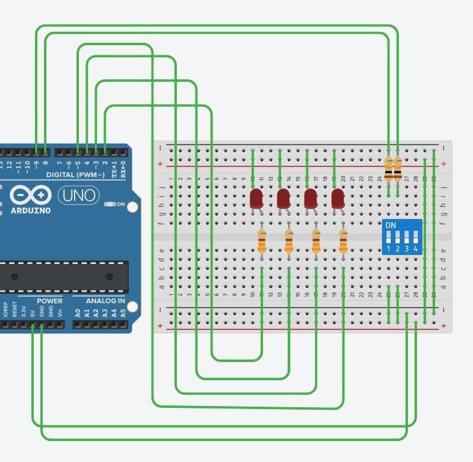
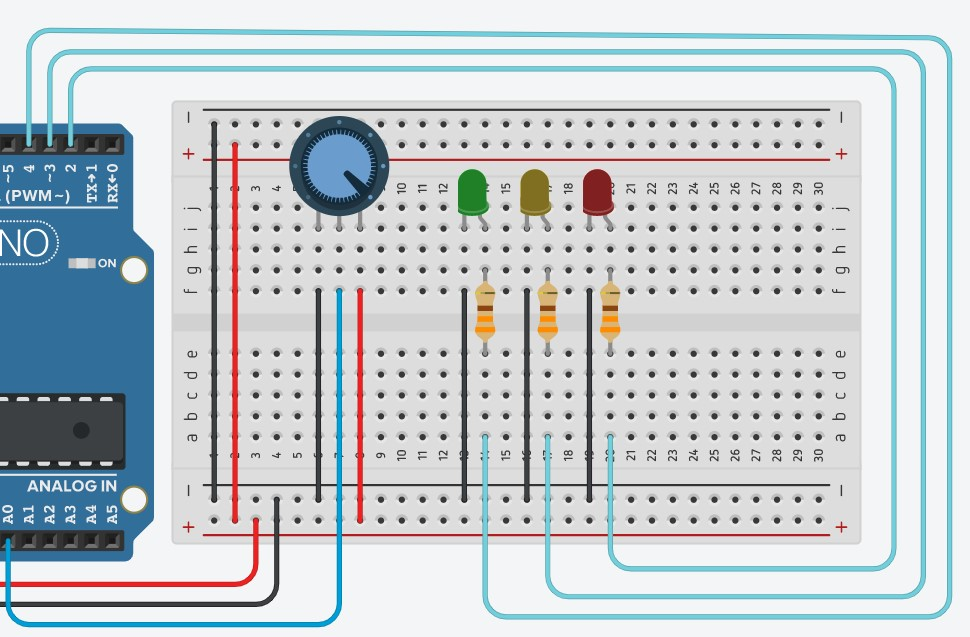
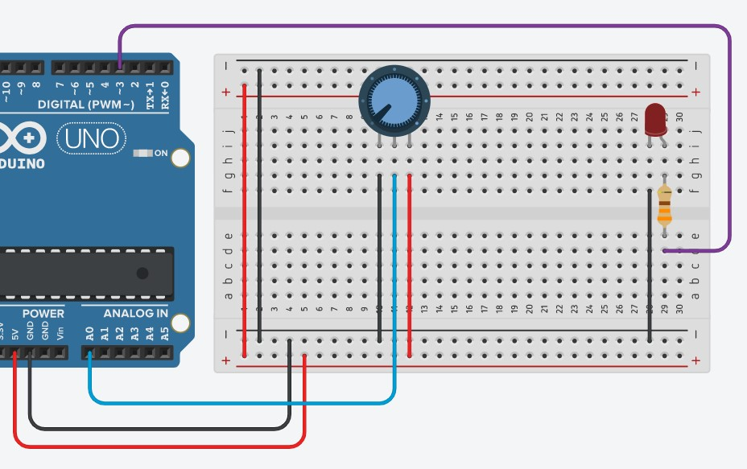
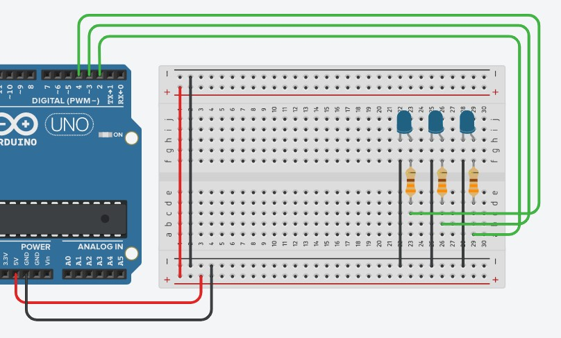

# Sistemas Físicos Interactivos 1
Repositorio del curso Sistemas Físicos Interactivos, UPB. Parte de mi intercambio en la Universidad Pontificia Bolivariana.

## Tabla de contenidos
- [Sistemas Físicos Interactivos 1](#sistemas-físicos-interactivos-1)
  - [Tabla de contenidos](#tabla-de-contenidos)
  - [TO DO List 😊](#to-do-list-)
  - [Recursos del curso](#recursos-del-curso)
  - [A tener en cuenta 🚨](#a-tener-en-cuenta-)
  - [Unidad 1](#unidad-1)
    - [Retos](#retos)
  - [Unidad 2](#unidad-2)

## TO DO List 😊
- [x] Avanzar del ejercicio 10 al 20.
- [ ] Avanzar desde el ejercicio 15.

## Recursos del curso
- [Repositorio del curso](https://sistemasfisicosinteractivos1.readthedocs.io/es/latest/index.html)
- [Github del profesor](https://github.com/juanferfranco)
  
## A tener en cuenta 🚨
- Buttons: Los push buttons tienes que tener si o si una resistencia de 10k, esto para que la entrada del microcontrolador esté definida en 0 o 1 y no en un rango en el medio.
- Variables locales y globales: La variables locales solo permanecen en un bloque de codigo y cuando el programa sale de ese bloque, la variable **se destruye**. Si el programa regresa a ese bloque de codigo entonces la variable **volverá a crearse**.
- Variable *static*: La variable será accesible solo en el bloque de codigo que se creo sin embargo su valor permanecerá aun despues de haber terminado con ese bloque. Es una mezcla entre local y global. **Solo se puede declarar una vez**.

## Unidad 1
### Retos
- Ejercicio 5: Realiza un programa que lea el estado de dos switches y encienda solo uno de 4 LEDs (un LED para cada combinación posible de los switches).
    ``` Arduino
    int sw_a, sw_b;

    void setup()
    {
    pinMode(2, OUTPUT);
    pinMode(3, OUTPUT);
    pinMode(4, OUTPUT);
    pinMode(5, OUTPUT);
    pinMode(8,INPUT);
    pinMode(9,INPUT);
    Serial.begin(9600);
    }

    void loop()
    {
    sw_a = digitalRead(8);
    sw_b = digitalRead(9);

    if(sw_a == 0 && sw_b == 0){
        prender_led(2);
    }
    else if(sw_a == 0 && sw_b == 1){
        prender_led(3);
    }
    else if(sw_a == 1 && sw_b == 0){
        prender_led(4);
    }
    else if(sw_a == 1 && sw_b == 1){
        prender_led(5);
    }
    else{
        Serial.println("No valido!");
    }
    }

    int prender_led(int a){
    for(int i=1; i<=5; i++){
        if(i == a){
        digitalWrite(i,1);
        }
        else{
        digitalWrite(i,0);
        }
    }
    }
    ```
    
- Ejercicio 7: Modifique el código del reto anterior para indicar por el puerto serial cuál de los 4 LEDs está encendido.
[Referencia: Concatenar String, Arduino](https://www.arduino.cc/en/Tutorial/BuiltInExamples/StringAdditionOperator)
    ```Arduino
    int sw_a, sw_b;

    void setup()
    {
    pinMode(2, OUTPUT);
    pinMode(3, OUTPUT);
    pinMode(4, OUTPUT);
    pinMode(5, OUTPUT);
    pinMode(8,INPUT);
    pinMode(9,INPUT);
    Serial.begin(9600);
    }

    void loop()
    {
    sw_a = digitalRead(8);
    sw_b = digitalRead(9);
    
    if(sw_a == 0 && sw_b == 0){
        prender_led(2);
    }
    else if(sw_a == 0 && sw_b == 1){
        prender_led(3);
    }
    else if(sw_a == 1 && sw_b == 0){
        prender_led(4);
    }
    else if(sw_a == 1 && sw_b == 1){
        prender_led(5);
    }
    else{
        Serial.println("No valido!");
    }
    }

    int prender_led(int a){
    String text = "LED encendido en puerto I/O: ";
    Serial.println(text + a);
    for(int i=1; i<=5; i++){
        if(i == a){
        digitalWrite(i,1);
        }
        else{
        digitalWrite(i,0);
        }
    }
    }
    ```
- Ejercicio 9: Realiza el montaje en tinkercad y un programa para el microcontrolador que lea el valor de una entrada analógica. Si la entrada es menor a 340 enciende un led verde y envía por el puerto serial solo una vez LED_VERDE. Si es mayor a 340 pero menor a 700 enciende solo el LED amarillo y envía por el puerto serial solo una vez LED_AMARILLO. Finalmente, si es mayor a 700 enciende solo el LED rojo y envía por el puerto serial solo una vez LED_ROJO. Ten en cuenta que al entrar a cada rango se debe enviar solo una vez el mensaje por el puerto serial.
    ```Arduino
    void setup()
    {
    pinMode(2, OUTPUT);
    pinMode(3, OUTPUT);
    pinMode(4, OUTPUT);
    Serial.begin(9600);
    }

    void loop()
    {
    int signalPot = analogRead(A0);
    Serial.println(signalPot);
    if (signalPot < 340){
        digitalWrite(4, HIGH);
        digitalWrite(3, LOW);
        digitalWrite(2, LOW);
        Serial.println("LED VERDE ENCENDIDO");
    }
    else if(signalPot < 700){
        digitalWrite(4, LOW);
        digitalWrite(3, HIGH);
        digitalWrite(2, LOW);
        Serial.println("LED AMARILLO ENCENDIDO");
    }
    else {
        digitalWrite(4, LOW);
        digitalWrite(3, LOW);
        digitalWrite(2, HIGH);
        Serial.println("LED ROJO ENCENDIDO");
    }
    
    delay(500);
    }
  ```
  
- Ejercicio 11: Monta un circuito (en tinkercad) o tanto mejor si tienes hardware real y realiza un programa que permita controlar el brillo de un LED mediante un potenciómetro.
    ```Arduino
    #define ledPin 3

    int _valuePot = 0;
    int valuePot = 0;

    void setup()
    {
    pinMode(ledPin, OUTPUT);
    Serial.begin(9600);
    }

    void loop()
    {
    // leer el valor del potenciometro
    _valuePot = analogRead(A0);
    
    
    // mapear el valor a 0 - 255
    valuePot = map(_valuePot, 0, 1023, 0, 255);
    Serial.println(valuePot);
    
    // encendido del led por PWM
    analogWrite(ledPin, valuePot);
    
    delay(100);
    }
    ```
    
- Ejercicio 14: Realice un programa que encienda y apague tres LEDs a 1 Hz, 5 Hz y 7 Hz respectivamente utilizando la técnica vista en el ejercicio anterior.
    ```Arduino
    const uint8_t ledPin_1 = 2;
    const uint8_t ledPin_5 = 3;
    const uint8_t ledPin_7 = 4;

    uint8_t ledState_1 = LOW;
    uint8_t ledState_5 = LOW;
    uint8_t ledState_7 = LOW;

    uint32_t previousMillis = 0;
    const uint32_t interval = 1000;

    void setup() {
    // set the digital pin as output:
    pinMode(ledPin_1, OUTPUT);
    pinMode(ledPin_5, OUTPUT);
    pinMode(ledPin_7, OUTPUT);
    }

    void loop() {
    uint32_t currentMillis = millis();
    uint32_t deltaTime = currentMillis - previousMillis;
    static uint8_t counter = 0;

    if (deltaTime >= interval) {
        previousMillis = currentMillis;
        counter++;

        if (ledState_1 == LOW) {
        ledState_1 = HIGH;
        digitalWrite(ledPin_1, HIGH);
        } else {
        ledState_1 = LOW;
        digitalWrite(ledPin_1, LOW);
        }

        if (counter % 7 == 0) {
        if (ledState_7 == LOW) {
            ledState_7 = HIGH;
            digitalWrite(ledPin_7, HIGH);
        } else {
            ledState_7 = LOW;
            digitalWrite(ledPin_7, LOW);
        } 
        }
        else {
            ledState_7 = LOW;
            digitalWrite(ledPin_7, LOW);
        }

        if (counter % 5 == 0) {
        if (ledState_5 == LOW) {
            ledState_5 = HIGH;
            digitalWrite(ledPin_5, HIGH);
        } else {
            ledState_5 = LOW;
            digitalWrite(ledPin_5, LOW);
        }
        } else {
        ledState_5 = LOW;
        digitalWrite(ledPin_5, LOW);
        }

    }
    }
    ```
    

## Unidad 2
